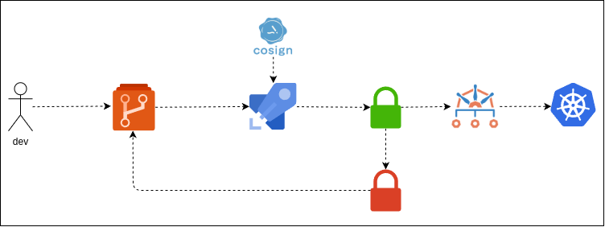

# Cosign and Kyverno: Securing Your Docker Supply Chain

This project demonstrates a simple and practical way to **implement container image signing and admission control** in your DevOps workflow using **Cosign** and **Kyverno**.

The goal is to prevent unsigned or unverified container images from being deployed in your Kubernetes cluster.

---

## Overview



---

## Prerequisites

Make sure you have the following tools installed:

- [Cosign](https://docs.sigstore.dev/system_config/installation/)
- [Kind](https://kind.sigs.k8s.io/) 
- [Kyverno](https://kyverno.io/)
- [kubectl](https://kubernetes.io/docs/tasks/tools/)

---

## Step 1: Create a Kind Cluster

Use the following command to create a local Kind cluster:

```bash
kind create cluster --config=k8s/cluster.yaml
```

## Step 2: Install NGINX Ingress Controller

Deploy the NGINX Ingress Controller to your cluster:
```bash
kubectl --namespace ingress-nginx apply -f https://raw.githubusercontent.com/kubernetes/ingress-nginx/main/deploy/static/provider/kind/deploy.yaml
```

## Step 3: Deploy the Application

Apply the Kubernetes manifests for the sample application:
```bash
kubectl apply -f k8s/app/
```

## Step 4: Install Kyverno

Add the Kyverno Helm repository and install Kyverno in your cluster:
```bash
helm repo add kyverno https://kyverno.github.io/kyverno/
helm repo update
helm install kyverno kyverno/kyverno -n kyverno --create-namespace
```

## Step 5: Apply Kyverno Policy Rules:

Apply the Kyverno policy that enforces signed container images:
```bash
kubectl apply -f k8s/kyverno
```


